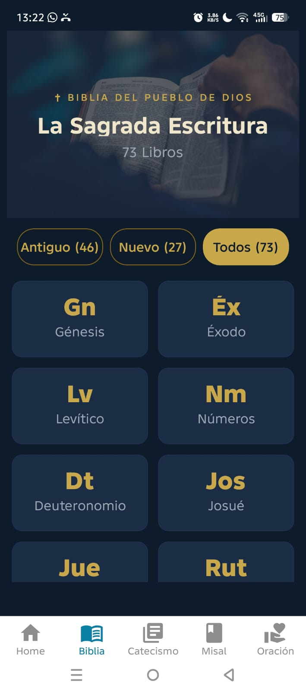
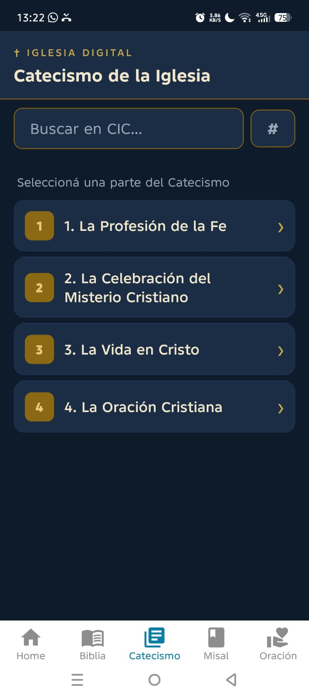

# ✝️ Iglesia Digital

Una aplicación móvil católica desarrollada con **Expo** y **React Native**, diseñada para acompañar la vida de fe. Centraliza textos sagrados (Biblia, Catecismo, Misal Romano) y herramientas de oración con una interfaz minimalista y elegante, combinando consulta de textos con elementos de gamificación espiritual.

---

## 📱 Capturas de pantalla

| Home | Biblia | Catecismo | Misal | Oración |
|------|--------|-----------|-------|---------|
|  |  |  |  |  |
| Versículo del día, rachas 🔥 y acceso rápido | Navegación por libros, capítulos y versículos | Navegación multinivel por partes y numerales | Misal Romano: Propio, Ordinario, Prefacios, Plegarias | Rosario, Coronilla, Oraciones del Vaticano, Novenas |

---

## ✨ Funcionalidades

- **Versículo del Día** — Pasaje bíblico dinámico en la pantalla principal con fecha en español
- **Rachas** — Gamificación espiritual: seguimiento de días consecutivos de lectura de la Biblia y el Rosario
- **Biblia del Pueblo de Dios** — Navegación completa en 3 niveles:
  - 📖 Lista de libros con distinción Antiguo/Nuevo Testamento
  - 🔢 Selección de capítulo en grilla
  - 📜 Lectura de versículos con número dorado
- **Catecismo de la Iglesia Católica (CIC)** — Navegación completa en 5 niveles:
  - Parte → Sección → Capítulo → Artículo → Numerales con jerarquía completa y búsqueda FTS5
- **Misal Romano (México)** — Ordinario de la Misa, Propio del Tiempo completo (157 días), 67 Prefacios y 4 Plegarias Eucarísticas, desde los PDFs oficiales de LiturgiaPapal
- **Misa de Hoy** — Lecturas diarias del leccionario + acceso rápido al Propio del Tiempo y Prefacios
- **Favoritos** — Marcá versículos y numerales como favoritos con persistencia en AsyncStorage
- **Rosario Guiado** — Recitación paso a paso con cuentas visuales, misterios según el día y registro de racha (🔥 días consecutivos)
- **Coronilla de la Divina Misericordia** — Guiada paso a paso con el mismo sistema de rachas
- **Oraciones del Vaticano** — 23 oraciones extraídas de Vatican News (Ángelus, Magnificat, Te Deum, etc.)
- **Jaculatorias** — 5 grupos de invocaciones con formato V./R.
- **Novenas** — 18 devociones de 9 días (Espíritu Santo, Virgen María, Inmaculada, etc.) con selector de día
- **Calendario Litúrgico** — Navegación mensual con indicador de lecturas disponibles
- **Evangelio del Día** — Lectura diaria desde el leccionario con fuente ajustable
- **Modo Lectura** — Control de tamaño de fuente (0.8×–1.5×) con persistencia
- **Búsqueda FTS5** — Búsqueda de texto completo optimizada en SQLite sobre CIC
- **100% Offline** — Toda la base de datos está incluida en la app

---

## 🛠️ Stack Tecnológico

| Tecnología | Versión | Uso |
|---|---|---|
| Expo | SDK 56 | Framework principal |
| React Native | 0.85.3 | UI nativa |
| TypeScript | 6.x | Tipado estático |
| expo-router | 56.x | Navegación basada en archivos (Tabs + Stacks) |
| expo-sqlite | 56.x | Base de datos local con soporte FTS5 |
| @shopify/flash-list | latest | Listas de alto rendimiento |
| react-native-reanimated | latest | Transiciones fluidas |
| react-native-safe-area-context | latest | Gestión de insets |

---

## 🗄️ Base de Datos

La app usa un archivo SQLite precompilado (`iglesia_digital.db`) ubicado en `AppMovil/assets/`, copiado al directorio de documentos local en el primer arranque.

**Tablas:**

```sql
-- Biblia del Pueblo de Dios
TABLE biblia_pueblo_dios (
  id          INTEGER PRIMARY KEY,
  libro       TEXT,
  capitulo    INTEGER,
  versiculo   INTEGER,
  texto       TEXT,
  testamento  TEXT   -- 'Antiguo' | 'Nuevo'
)

-- Catecismo de la Iglesia Católica (CIC) — 2865 numerales con capítulo/artículo poblados
TABLE catecismo_cic (
  id        INTEGER PRIMARY KEY,  -- Número de numeral (1-2865)
  parte     TEXT,                 -- 4 partes principales
  seccion   TEXT,                 -- 7 secciones
  capitulo  TEXT,                 -- extraído de marcadores textuales (2359 poblados)
  articulo  TEXT,                 -- extraído de marcadores textuales (1964 poblados)
  texto     TEXT NOT NULL
)

-- Leccionario diario (evangelio del día)
TABLE lecturas (
  id              INTEGER PRIMARY KEY AUTOINCREMENT,
  fecha           TEXT NOT NULL UNIQUE,  -- YYYY-MM-DD
  titulo_misa     TEXT,
  primera_lectura TEXT,
  salmo           TEXT,
  aleluia         TEXT,
  evangelio       TEXT
)

-- Misal Romano — Propio del Tiempo (Adviento, Navidad, Cuaresma, Pascua, Ordinario)
TABLE misal_propio (
  id        INTEGER PRIMARY KEY AUTOINCREMENT,
  temporada TEXT NOT NULL,       -- adviento | navidad | cuaresma | pascua | ordinario
  dia       TEXT NOT NULL,       -- nombre del día o fecha
  titulo    TEXT,
  entrada   TEXT,
  oracion   TEXT,
  ofrendas  TEXT,
  comunion  TEXT,
  poscomunion TEXT,
  unico     TEXT                -- algunos días tienen formato distinto (1 bloque)
)

-- Misal Romano — Ordinario de la Misa
TABLE misal_ordinario (
  id          INTEGER PRIMARY KEY AUTOINCREMENT,
  seccion     TEXT NOT NULL,     -- Ritos Iniciales, Liturgia de la Palabra, etc.
  titulo      TEXT,
  contenido   TEXT NOT NULL,
  orden       INTEGER
)

-- Misal Romano — Prefacios
TABLE misal_prefacios (
  id      INTEGER PRIMARY KEY AUTOINCREMENT,
  titulo  TEXT NOT NULL,
  texto   TEXT NOT NULL
)

-- Misal Romano — Plegarias Eucarísticas
TABLE misal_plegarias (
  id    INTEGER PRIMARY KEY AUTOINCREMENT,
  titulo TEXT NOT NULL,
  texto  TEXT NOT NULL
)

-- Novenas (devociones de 9 días)
TABLE novenas (
  id     INTEGER PRIMARY KEY AUTOINCREMENT,
  titulo TEXT NOT NULL,
  url    TEXT
)

-- Días de novena
TABLE novena_dias (
  id        INTEGER PRIMARY KEY AUTOINCREMENT,
  novena_id INTEGER NOT NULL,
  dia       INTEGER NOT NULL,
  titulo    TEXT,
  texto     TEXT NOT NULL,
  FOREIGN KEY (novena_id) REFERENCES novenas(id)
)
```

---

## 🚀 Instalación y ejecución

> **Nota sobre actualizaciones de BD:** Si la app muestra errores de columnas o tablas faltantes (ej. `no such column: parte` o `no such table: ..._fts`), la migración automática en `db/init.ts` los corrige al arrancar. También podés forzar la recreación borrando la DB almacenada en el dispositivo:
> ```bash
> adb shell "run-as com.iglesiadigital.app rm /data/data/com.iglesiadigital.app/files/ExpoLite/iglesia_digital.db"
> ```

### Requisitos previos

- [Node.js](https://nodejs.org/) 18+
- [Expo Go](https://expo.dev/client) en tu dispositivo Android/iOS

### Pasos

```bash
# 1. Clonar el repositorio
git clone https://github.com/Mauricio-Cardozo/Biblia-app.git
cd Biblia-app/AppMovil

# 2. Instalar dependencias
npm install

# 3. Iniciar el servidor de desarrollo
npx expo start -c

# 4. Escanear el QR con Expo Go
```

> **Nota para CachyOS / Arch Linux (fish shell):** Los heredocs `<< 'EOF'` no funcionan en fish. Usá `python3 -c "open(...).write(...)"` o editá los archivos directamente desde VS Code.

### Build APK (Android)

```bash
# 1. Instalar EAS CLI (si no lo tenés)
npm install -g eas-cli

# 2. Iniciar sesión en tu cuenta Expo
eas login

# 3. Build APK de desarrollo
eas build --platform android --profile preview

# 4. Build AAB para Play Store
eas build --platform android --profile production
```

---

## 📁 Estructura del Proyecto

```
Biblia-app/
├── AppMovil/                        # App principal (Expo)
│   ├── app/
│   │   ├── _layout.tsx              # Layout raíz — SQLiteProvider + DatabaseInit + Stack
│   │   ├── (tabs)/
│   │   │   ├── _layout.tsx          # Tab bar (Home, Biblia, Catecismo, Misal, Oración)
│   │   │   ├── index.tsx            # Home — versículo del día + rachas + acceso rápido
│   │   │   ├── biblia.tsx           # Biblia — libros → capítulos → versículos + selector de versión
│   │   │   ├── catecismo.tsx        # CIC — partes → secciones → numerales → detalle + FTS5
│   │   │   ├── misal.tsx            # Misal — Misa de Hoy, Propio, Ordinario, Prefacios, Plegarias
│   │   │   └── oracion.tsx          # Hub de oración — rosario, coronilla, oraciones del Vaticano, jaculatorias
│   │   ├── misal/
│   │   │   ├── hoy.tsx              # Misa de Hoy (lecturas + links al Propio)
│   │   │   ├── propio/
│   │   │   │   ├── _layout.tsx
│   │   │   │   ├── index.tsx        # Temporadas (Adviento, Navidad, Cuaresma, Pascua, Ordinario)
│   │   │   │   └── [id].tsx         # Detalle del día propio
│   │   │   ├── ordinario/
│   │   │   │   ├── _layout.tsx
│   │   │   │   ├── index.tsx        # Secciones del Ordinario
│   │   │   │   └── [id].tsx         # Detalle de sección
│   │   │   ├── prefacios/
│   │   │   │   ├── _layout.tsx
│   │   │   │   ├── index.tsx        # Lista de 67 prefacios
│   │   │   │   └── [id].tsx         # Texto del prefacio
│   │   │   └── plegarias/
│   │   │       ├── _layout.tsx
│   │   │       ├── index.tsx        # Lista de 4 plegarias
│   │   │       └── [id].tsx         # Texto de la plegaria
│   │   ├── rosario/
│   │   │   └── guia.tsx             # Guía interactiva del Rosario con misterios
│   │   ├── oraciones/
│   │   │   ├── index.tsx            # Lista de 23 oraciones del Vaticano
│   │   │   ├── [id].tsx             # Detalle de oración con fuente ajustable
│   │   │   ├── jaculatorias.tsx     # Jaculatorias agrupadas con V./R.
│   │   │   └── novena/
│   │   │       ├── index.tsx        # Lista de 18 novenas
│   │   │       └── [id].tsx         # Detalle con selector de día
│   │   ├── evangelio.tsx            # Lectura del día (evangelio + primera lectura + salmo)
│   │   ├── calendario.tsx           # Calendario litúrgico mensual con lecturas
│   │   ├── favoritos.tsx            # Todos los favoritos agrupados
│   │   └── test.tsx                 # Sandbox para pruebas de DB y FTS5
│   ├── db/
│   │   └── init.ts                  # Migración automática de BD al arrancar
│   ├── components/
│   │   ├── themed-text.tsx
│   │   └── themed-view.tsx
│   ├── types/
│   │   └── index.ts                 # Interfaces compartidas (Book, CICNumeral, etc.)
│   ├── constants/
│   │   └── theme.ts                 # Paleta Navy/Gold + tokens C
│   └── assets/
│       └── iglesia_digital.db       # Base de datos SQLite
    ├── archive/                         # Scripts Python de ingesta de datos
    │   ├── popular_cic.py               # Extrae capítulo/artículo de marcadores textuales del CIC
    │   ├── scraper_vaticano.py          # Vatican News → SQLite (lecturas diarias)
    │   ├── scraper_cic.py               # PDF del CIC → SQLite (catecismo_cic)
    │   ├── scraper_misal.py             # PDFs del Misal Romano → SQLite (157 días propios + Ordinario + Prefacios + Plegarias)
    │   ├── scraper_biblia.py            # Scraper original de la Biblia
    │   ├── scraper_oraciones_vatican.py # 23 oraciones desde Vatican News → JSON
    │   └── scraper_novenas.py           # 18 novenas desde devocionario.com → SQLite/JSON
    └── misal_pdfs/                  # 17 PDFs del Misal Romano (LiturgiaPapal México)
```

---

## 🎨 Diseño

Paleta **Navy Blue y Dorado** inspirada en los colores litúrgicos:

| Token | Hex | Uso |
|---|---|---|
| `navy` | `#0D1B2A` | Fondo principal |
| `navyMid` | `#1A2D45` | Cards y headers |
| `navyLight` | `#243B55` | Botones y elementos secundarios |
| `gold` | `#C9A84C` | Acentos, números de versículo |
| `goldLight` | `#E8C97A` | Texto destacado |
| `text` | `#F0E6CC` | Texto principal |

---

## 🗺️ Roadmap

### ✅ Completado

- [x] Biblia del Pueblo de Dios — navegación completa + selector de versión
- [x] Catecismo CIC — navegación multinivel (5 niveles) + FTS5
- [x] Misal Romano — Propio del Tiempo (157 días), Ordinario (202 bloques), 67 Prefacios, 4 Plegarias Eucarísticas
- [x] Rosario guiado con misterios y rachas 🔥
- [x] Coronilla de la Divina Misericordia guiada
- [x] Evangelio del Día desde el leccionario
- [x] Calendario litúrgico mensual
- [x] Favoritos (versículos bíblicos + numerales CIC)
- [x] 23 oraciones del Vaticano
- [x] Jaculatorias agrupadas
- [x] Versículo del Día — pasaje destacado en la pantalla principal
- [x] Misa de hoy — lecturas diarias del leccionario con acceso al Propio del Tiempo
- [x] CIC capítulo/artículo poblado — 2359/2865 caps, 1964/2865 arts extraídos vía `popular_cic.py`
- [x] Modo lectura (fuente ajustable 0.8×–1.5×)
- [x] Novenas — 18 devociones de 9 días
- [x] Expo SDK 54 → 56 (React 19.2.3, RN 0.85.3)
- [x] Rebranding — nombre, icono personalizado, splash
- [x] **Bugs corregidos** — `\n` literal en letanías, `?fecha` en favoritos a evangelio, `find()` cliente → query directa en detalle de ordinario/prefacios/plegarias, `.catch()` faltantes, `#D4AF37` → `C.gold`, `catch(e: any)` → `instanceof Error`
- [x] **Compartir versículos** — botón ↗ por versículo en Biblia y en header de Evangelio, vía `Share.share`
- [x] **Export/import AsyncStorage** — backup de favoritos/rachas/font-size via `Share.share` + paste restore en Ajustes
- [x] **Limpieza de deuda técnica** — eliminado `modal.tsx`, `collapsible.tsx`, `hasColumn`. Movido `getLecturaDelDia` al bloque correcto en `db/db.ts`. Completado tipo `Lectura` con columnas faltantes.
- [x] **Eliminar duplicación** — `formatoFecha`/`hoy()`, mapa de emojis de temporadas, layout de sección de lecturas extraídos a `utils/date.ts`, `utils/seasons.ts`, `components/reading-section.tsx`.
- [x] **Tokens de diseño** — `constants/spacing.ts` (S.*) y `constants/radius.ts` (R.*) creados + refactorizados en ~25 archivos
- [x] **StatusBar + NavigationBar ocultos** en toda la app vía `expo-navigation-bar`
- [x] **Ajustes screen** — gear ⚙️ en Home, versión dinámica, font-size, export/import de datos
- [x] **Rediseño navegación** — tab bar flotante redondeada, scroll-to-hide, ajustes en Home, calendario como tab

### 🔴 Corto plazo (alta prioridad)

- [ ] **Rediseño de Home** — hero section con saludo ("Buenos días hermano/hijo"), santo del día, color litúrgico, evangelio destacado, acceso rápido a rachas. Inspirado en Lummen.
- [ ] **Notificaciones bíblicas diarias** — evangelio del día a las 7am, versículo aleatorio al mediodía, recordatorio de rachas. Basado en `expo-notifications` + SQLite.
- [ ] **Split-pane / multi-ventana** — dos paneles simultáneos (Biblia + CIC, o Lecturas + Reflexión). Prioritario en tablets.
- [ ] **Sistema de etiquetas, highlights y notas** — expandir favs actuales con etiquetas de colores, resaltado de versículos, notas personales.

### 🟡 Mediano plazo
- [ ] **Configuraciones funcionales** — tema claro/oscuro real, notificaciones push (expo-notifications), ayuda integrada.
- [ ] **Animaciones y transiciones** — shared elements, hero animations, fade, scale, skeletons, microinteracciones. Inspirado en Lummen.
- [ ] **Widget Android** — versículo del día, racha y acceso rápido desde la pantalla de inicio.
- [ ] **Search global** — buscar en Biblia + CIC + Misal desde un campo unificado (FTS5 ya existe).
- [ ] **Workspaces** — guardar combinaciones de pantalla (ej. "Devocional matutino" con lectura + salmo)
- [ ] **Bloc de notas (Study Pad)** — notas personales con referencias bíblicas enlazables
- [ ] **Text-to-Speech** — botón "Escuchar" en Biblia/lecturas con control de velocidad
- [ ] **Deep linking** — compartir versículos via `iglesiadigital://biblia/Libro/Capítulo/Versículo`
- [ ] **Personalización visual** — selección de fuente (serif/sans), interlineado, temas
- [ ] **Referencias cruzadas** — cross-references clicables entre versículos

### 🟢 Largo plazo

- [ ] **Planes de lectura** — "Biblia en 1 año" con progreso y checkmarks
- [ ] **Strong's / palabras originales** — griego/hebreo con concordancia (requiere datos en DB)
- [ ] **Memorización** — modo de ocultar palabras para aprender versículos
- [ ] **Módulos descargables** — más traducciones bíblicas y comentarios vía descarga
- [ ] **Cloud Sync** — sincronización de favoritos/notas/rachas
- [ ] **i18n** — soporte multilingüe (inglés, portugués)
- [ ] **Integración IA** — "Explicar este pasaje" con API key propia del usuario
- [ ] **Sincronización en la nube (Firebase)**
- [ ] **Biblia de Jerusalén** (pendiente de conseguir texto digital)
- [ ] **Modo discreto** — apariencia alternativa para entornos restringidos

---

## 🛠️ Scripts de Datos (Python)

Los scripts en `archive/` procesan los PDFs o sitios web y generan la base de datos:

```bash
# Instalar dependencia (solo para scrapers PDF)
pip install pdfplumber --break-system-packages

# Scrapear lecturas diarias desde Vatican News (sin dependencias externas)
python3 archive/scraper_vaticano.py                          # mes actual + siguiente
python3 archive/scraper_vaticano.py --fecha 2026-06-11       # una fecha
python3 archive/scraper_vaticano.py --desde 2026-01-01 --hasta 2026-06-30
python3 archive/scraper_vaticano.py --preview --fecha 2026-06-11
python3 archive/scraper_vaticano.py --list                   # ver registros

# Generar catecismo_cic desde el PDF oficial
python3 archive/scraper_cic.py --preview   # vista previa sin guardar
python3 archive/scraper_cic.py             # genera la DB

# Scrapear Misal Romano desde 17 PDFs (LiturgiaPapal México)
python3 archive/scraper_misal.py --preview                                   # resumen de lo parseado
python3 archive/scraper_misal.py                                             # escribe en AppMovil/assets/iglesia_digital.db

# Poblar capítulo/artículo del CIC desde marcadores textuales
python3 archive/popular_cic.py                                               # extrae y actualiza catecismo_cic.capitulo + articulo

# Scrapear oraciones desde Vatican News (sin dependencias externas)
python3 archive/scraper_oraciones_vatican.py          # imprime JSON en stdout
python3 archive/scraper_oraciones_vatican.py > oraciones.json

# Novenas desde devocionario.com (sin dependencias externas)
python3 archive/scraper_novenas.py --preview           # vista previa JSON
python3 archive/scraper_novenas.py --db assets/db.db   # escribir en DB
```

---

## 🙏 Créditos

- **Biblia del Pueblo de Dios** — Texto bíblico en español latinoamericano
- **Catecismo de la Iglesia Católica** — © Libreria Editrice Vaticana
- **Misal Romano (México)** — © LiturgiaPapal.org / Conferencia del Episcopado Mexicano
- Desarrollado con ❤️ por [Mauricio](https://github.com/Mauricio-Cardozo)

---

## 📄 Licencia

Proyecto de uso personal y educativo. Los textos bíblicos y catequéticos pertenecen a sus respectivos propietarios.

---

### 📊 Análisis comparativo

Ver [`analisis-andbible.md`](./analisis-andbible.md) para un análisis detallado de features de [AndBible](https://github.com/AndBible/and-bible) y priorización para Iglesia Digital.
